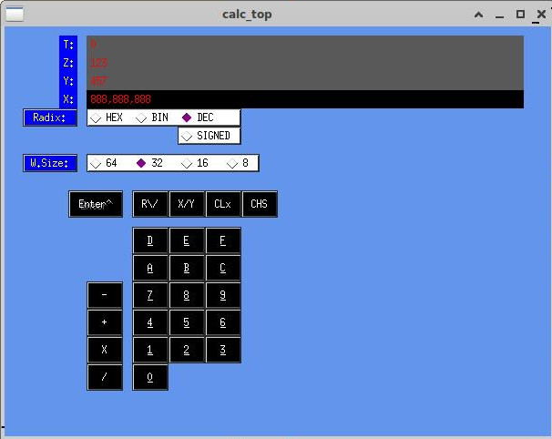

# calc-demo-xwin
## X-Windows calculator demo application

This is a simple X-Windows application using the old XForms library
to experiment with various calculator UI features.  This may or may
not be ever implemented in a real calculator!

To build:
```
  $ cd src
  $ make clean
  $ make
```

Very early screenshot below

[]

## Todo

* ENTER should duplicate X but set flag to over-type
* Fix decimal entry so digits roll off in a sensible way
* What to do if you enter a value above unsigned max in decimal?
* check arithmetic behavior vs word size
* add some more functions and hot-keys
* add hot-key menu somewhere
